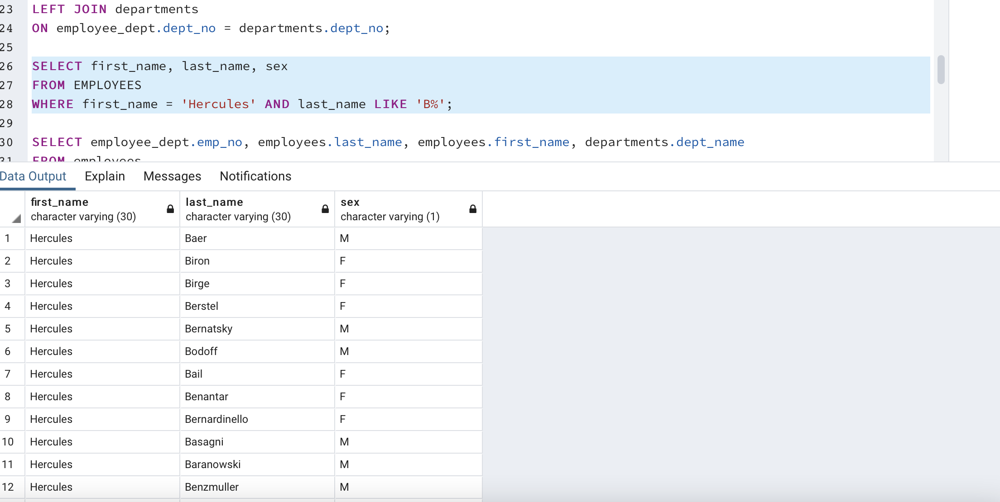

# Employee SQL Database

## Scope

This project created a database using SQL to store multiple tables with employee information. By housing the data here it makes it easier to looks up information and combine it with info that is stored in another table. Making use of correct joins and primary keys allows users to find the relevant data that they need in a timely and efficient manner.  

## Technologies Used
PostgeSQL - SQL database where tables and data where created and stored

PgAdmin - used to create schemas for tables and queries for searching them  

